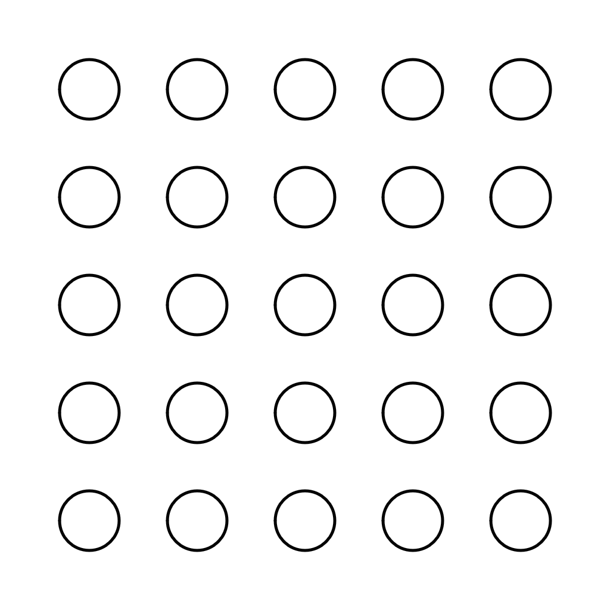
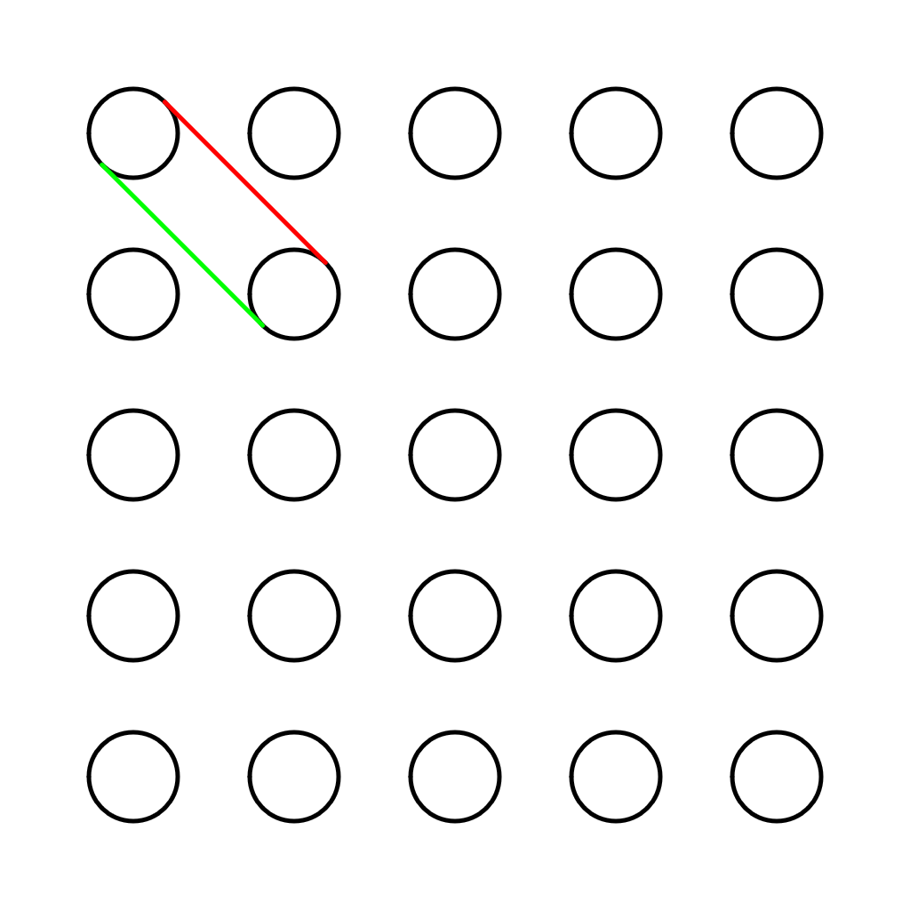
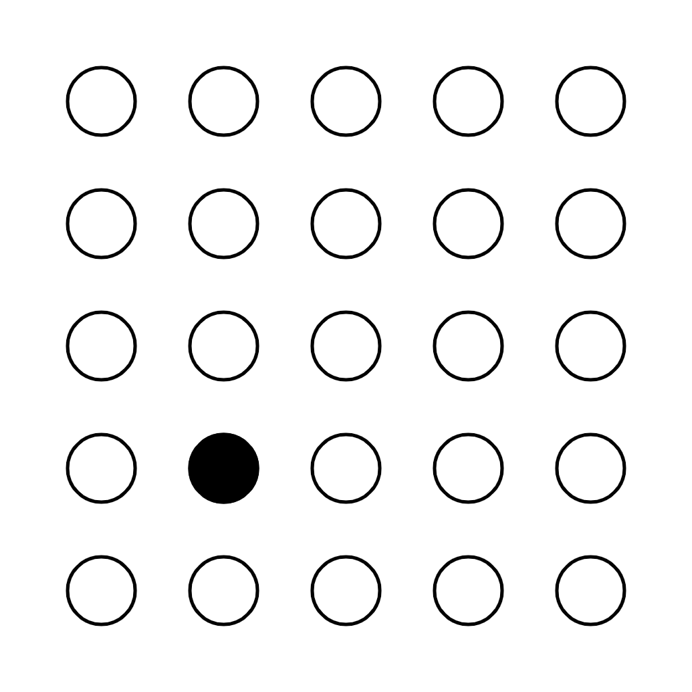
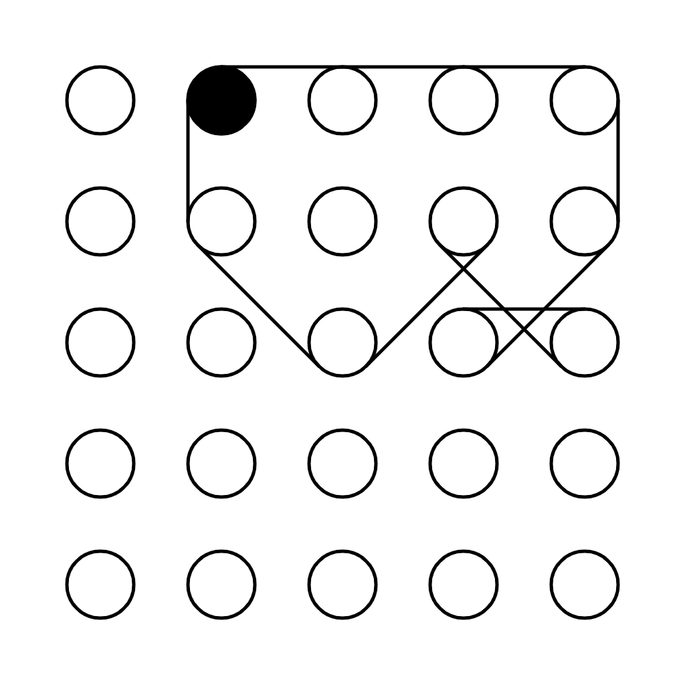
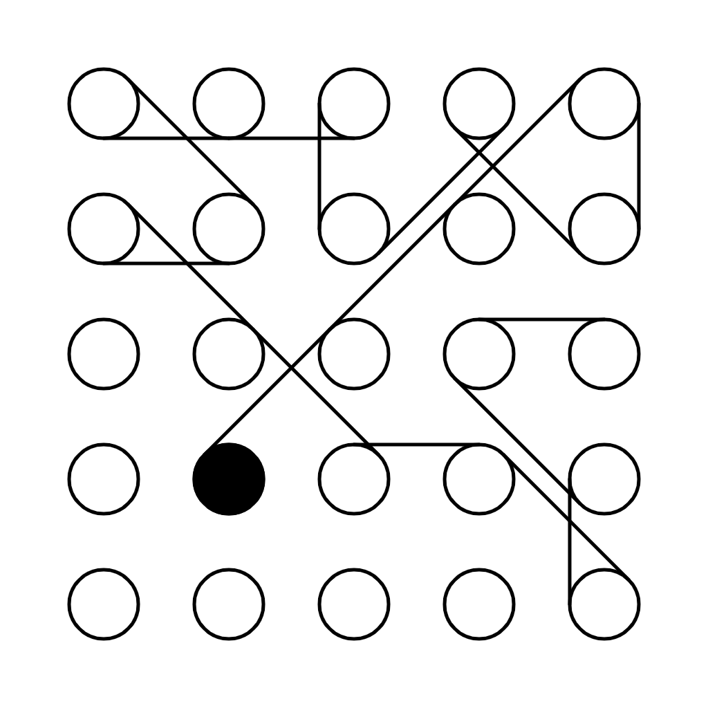

# DIY Ringers

When I first saw [Ringers](https://artblocks.io/project/13) by [Dmitri Cherniak](https://linktr.ee/dmitricherniak), I was blown away by the aesthetic variety of the algorithm. If you're not familiar with it, I highly recommend that you head over to the site and scroll through some of the output results. This is groundbreaking generative art. From the project description:

> There are an almost infinite number of ways to wrap a string around a set of pegs. On the surface it may seem like a simple concept but prepare to be surprised and delighted at the variety of combinations the algorithm can produce. Each output from 'Ringers' is derived from a unique transaction hash and generated in Javascript in the browser. Feature variations include peg count, sizing, layout, wrap orientation, and a few colorful flourishes for good measure.

Ok, wrapping a string around a set of pegs. Sounds easy. Well, implementing it turns out to present some challenges, which I'll walk you through in this tutorial. We might not be able to [afford a Ringer](https://opensea.io/assets/art-blocks?search%5BstringTraits%5D%5B0%5D%5Bname%5D=Ringers&search%5BstringTraits%5D%5B0%5D%5Bvalues%5D%5B0%5D=All%20Ringers), but reverse engineering it is free (disclaimer: this is purely for educational purposes).

I'll be using [Typescript](https://www.typescriptlang.org/)+[Processing](https://processing.org/) since I hate Javascript and since Processing is awesome. I'll also be using [canvas-sketch](https://github.com/mattdesl/canvas-sketch), which takes care of a lot of the background tasks (saving images, setting up the canvas element, etc). There's a short explanation [here](https://gist.github.com/mattdesl/1e9ab019534838e8c870ae06371be469) on how to set it up with Typescript.

We'll start by creating a grid of evenly spaced circles. First, we need to define a simple `Circle` class. We'll also need a `Point` class for the position of the circle.

```ts
class Point {
  public readonly x: number;
  public readonly y: number;

  constructor(x: number, y: number) {
    this.x = x;
    this.y = y;
  }
}

class Circle {
    public readonly pos: Point2d;
    public readonly r: number;

    constructor(x: number, y: number, r: number) {
        this.pos = new Point2d(x, y);
        this.r = r;
    }

    public get x(): number {
        return this.pos.x;
    }

    public get y(): number {
        return this.pos.y;
    }
}
```

For the grid itself, we'll define a `CircleGrid` class, whose constructor takes the number of desired rows and columns, the canvas width and height, a margin so that the circles aren't too close to the edge, and the radius of each circle.

```ts
class CircleGrid {
  public readonly entries: Circle[][];

  constructor(rows: number, cols: number, xWidth: number, yWidth: number, margin: number, radius: number) {
    this.entries = [];
    const stepx = (xWidth-2*(margin+radius)) / (cols-1);
    const stepy = (yWidth-2*(margin+radius)) / (rows-1);
    for (let r = 0; r < rows; r++) {
      this.entries[r] = [];
      for (let c = 0; c < cols; c++) {
        const x = margin+radius+stepx*c;
        const y = margin+radius+stepy*r;
        this.entries[r][c] = new Circle(x, y, radius);
      }
    }
  }
}
```

To evenly distribute the circles, we take the width/height and divide it by the number rows/columns (minus 1). To adjust for the margins and radius, we subtract `2*(margin+radius)` from the width/height. This gives us `stepx` and `stepy`, which we then use to position each circle.

Setting up the sketch itself and drawing the circles is rather straightforward. In `settings`, we define the canvas dimensions, the library which we'll be using (Processing in our case). We also define a `sketch` callback which we then pass to the `canvasSketch` init method with our `settings`. Currently, the `sketch` callback simply creates the grid and draws each circle.

```ts
const settings: any = {
  p5: { p5 },
  animate: false,
  dimensions: [ 1024, 1024 ]
};

interface Props {
  p5: p5;
  width: number;
  height: number;
  playhead: number;
}

const sketch = () => {
  return ({ p5, width, height, playhead }: Props) => {
    // Clear the background
    p5.background(255);
    p5.fill(255);
    p5.noStroke();

    // Create the grid
    const GRID_SIZE = 5;
    const MARGIN = 100;
    const RADIUS = 50;
    const grid = new CircleGrid(GRID_SIZE, GRID_SIZE, width, height, MARGIN, RADIUS);

    // Draw the circles
    p5.noFill();
    p5.stroke(0);
    p5.strokeWeight(5);
    const circles = grid.entries;
    for (const row of circles) {
      for (const circ of row) {
        p5.circle(circ.x, circ.y, 2*circ.r);
      }
    }
  };
};

canvasSketch(sketch, settings);
```



Now comes the interesting part. How do we wrap the string? Let's focus on the simple case where there are only two pegs. We can wrap the string either by going around or by going across. In this tutorial I'll handle the first case only. So, we basically want to be able to find these two tangent lines:



We get the red line by going clockwise from the upper circle to the lower circle, and the green line we get by going counter clockwise (or by going clockwise from the lower circle to the upper circle).

To find these lines, we first need to find the point on each circle which intersects the tangent line. This can be done by connecting a line between the center of each circle and normalizing it. We then rotate it by plus (or minus) PI and multiply by the radius. Adding this vector to the center point of circle gives us the desired intersection points. And in code:

```ts
type Line = [Point, Point];

// Assumes both circles have the same radius
function connectCircles(c1: Circle, c2: Circle, ccw: boolean): Line {
  const v = p0p1n(c1.pos, c2.pos).mult(c1.r).rot(ccw ? Math.PI/2 : -Math.PI/2);
  const p1 = new Point(c1.x+v.x, c1.y+v.y);
  const p2 = new Point(c2.x+v.x, c2.y+v.y);
  return [p1, p2];
}
```

There are a couple of things going on here. First, we take the center of each circle and compute a normalized vector pointing from one to the other:

```ts
function p0p1n(p0: Point, p1: Point): Vec2d {
  return new Vec2d(p1.x-p0.x, p1.y-p0.y).normalize();
}
```

We then multiply it by the radius and rotate by plus (or minus PI), depending on the parameter `ccw`. The `Vec2d` class used here is pretty standard stuff.

```ts
class Vec2d {
  public readonly x: number;
  public readonly y: number;

  constructor(x: number, y: number) {
    this.x = x;
    this.y = y;
  }

  mult(a: number) {
    return new Vec2d(a*this.x, a*this.y);
  }

  norm() {
    return Math.sqrt(this.x*this.x+this.y*this.y);
  }

  normalize() {
    return this.mult(1.0/this.norm());
  }

  rot(angle: number) {
    const x = this.x*Math.cos(angle) - this.y*Math.sin(angle);
    const y = this.x*Math.sin(angle) + this.y*Math.cos(angle);
    return new Vec2d(x, y);
  }
}
```

Ok, we're about halfway through. We now have to wrap our string around the pegs. We'll choose some starting point, and from there advance to a randomly chosen neighbor, always wrapping the string in a clockwise fashion until we return to the starting point. We'll need to add the list of neighbors to our `Circle` class:

```ts
class Circle {
  ...
  public neighbors: Circle[];

  constructor(x: number, y: number, r: number) {
    ...
    this.neighbors = [];
  }

  appendNeighbor(n: Circle) {
    this.neighbors.push(n);
  }
}
```

And update these neighbors in the grid constructor, taking into account the edges as needed:

```ts
class CircleGrid {
  public readonly entries: Circle[][];

  constructor(rows: number, cols: number, xWidth: number, yWidth: number, margin: number, radius: number) {
    ...

    const grid = this.entries;
    for (let r = 0; r < rows; r++) {
      for (let c = 0; c < cols; c++) {
        const circ = grid[r][c];
        if (r>0 && c>0)           circ.appendNeighbor(grid[r-1][c-1]);
        if (r>0)                  circ.appendNeighbor(grid[r-1][c]);
        if (r>0 && c<cols-1)      circ.appendNeighbor(grid[r-1][c+1]);
        if (c>0)                  circ.appendNeighbor(grid[r][c-1]);
        if (c<cols-1)             circ.appendNeighbor(grid[r][c+1]);
        if (r<rows-1 && c>0)      circ.appendNeighbor(grid[r+1][c-1]);
        if (r<rows-1)             circ.appendNeighbor(grid[r+1][c]);
        if (r<rows-1 && c<cols-1) circ.appendNeighbor(grid[r+1][c+1]);
      }
    }
  }
}
```

Now comes the fun part. Starting from some random peg, we want to choose a neighbor that wasn't chosen before. We will need two helper functions for this. The first is for choosing a random element from an array:

```ts
export function choose(obj: any) {
  const keys = Object.keys(obj);
  const idx = Math.floor(Math.random()*keys.length);
  return obj[keys[idx]];
}
```

and the second is for taking all of the elements that are in `A` but not in `B` (i.e the difference of the two sets):

```ts
function setDifference(A: any[], B: any[]) {
  return A.filter(x => B.indexOf(x) < 0);
}
```

We're finally ready to start wrapping our string. We'll choose a starting point and paint it in black:

```ts
let startingCircle = choose(choose(circles));
p5.push();
p5.fill(0);
p5.circle(startingCircle.x, startingCircle.y, 2*startingCircle.r);
p5.pop();
```



And then do the string wrapping:

```ts
function wrapString(startingCircle: Circle): Circle[] {
  let currentCircle = startingCircle;
  let nextCircle;
  let ring = [currentCircle];
  let v0, v1;
  do {
    nextCircle = findCandidate(currentCircle, ring);
    if (!nextCircle) {
      break;
    }

    ring.push(nextCircle);
    currentCircle = nextCircle;
  } while (nextCircle !== ring[0])

  return ring;
}
```

At each step, we ask `findCandidate` for the next circle and then, if one was found, push it onto the `ring` array. When `findCandidate` returns to the starting point or was unable to find a unwrapped circle, we break from the loop.

This is the code for finding the next circle:

```ts
function findCandidate(currentCircle: Circle, ring: Circle[]): Circle | null {
  const candidates = setDifference(currentCircle.neighbors, setDifference(ring, [ring[0]]));
  let nextCircle;
  let v0: Vec2d;
  let v1: Vec2d;
  do {
    nextCircle = choose(candidates);
    const idx = candidates.indexOf(nextCircle);
    if (idx > -1) {
      candidates.splice(idx, 1);
    }
    else {
      console.log('Could not close the ring :(');
      return null;
    }
    v0 = p0p1n(new Point(0, 0), currentCircle.pos);
    v1 = p0p1n(new Point(0, 0), nextCircle.pos);
  } while (cross(v0, v1) > 0 && candidates.length > 0)

  return nextCircle;
}
```

There's a bit going on here so let's break it down:

1. Compute the candidate neighbors for the current circle. We can jump to any one of our neighbors as long as they were not previously wrapped by the string, which is why we exclude `ring[1...end]`, keeping `ring[0]` so that we can close the ring
2. Randomly choose one of the candidates. If there are no candidates (`idx < 0`), return null. Otherwise, compute the cross product of `v0` and `v1`. If it's positive, it means that we can't connect with the peg by going clockwise so we need to try another one. We continue this way until we find a well oriented peg or are out of candidates.

Finally, drawing the ring is straightforward:

```ts
// Compute and draw ring
const ring = wrapString(startingCircle);
for (let i = 0; i < ring.length-1; i++) {
  const line = connectCircles(ring[i], ring[i+1], false);
  p5.line(line[0].x, line[0].y, line[1].x, line[1].y);
}
```



And we're done! You can find the full source code [here](https://github.com/nahumfarchi/nahumfarchi.github.io/blob/main/generative/DIY-ringers.ts). The original piece obviously has a lot more nuance to it, but this is the basic idea (or my interpretation of it anyway). Note that we'll not always be able to close the ring, for example:



We could in theory use some backtracking to make sure that we always find a closed solution, but I'll leave that for a another post.
